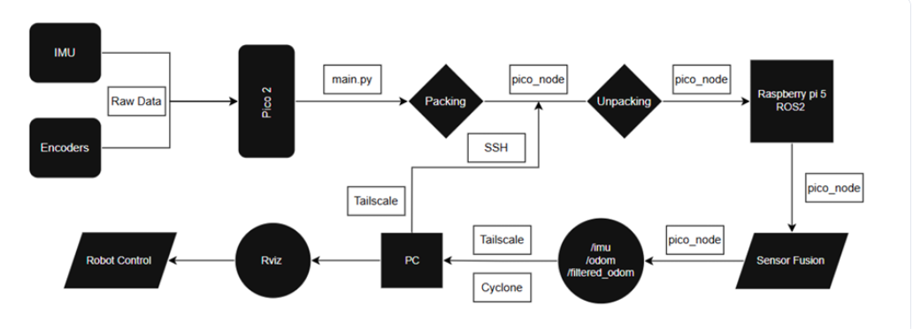
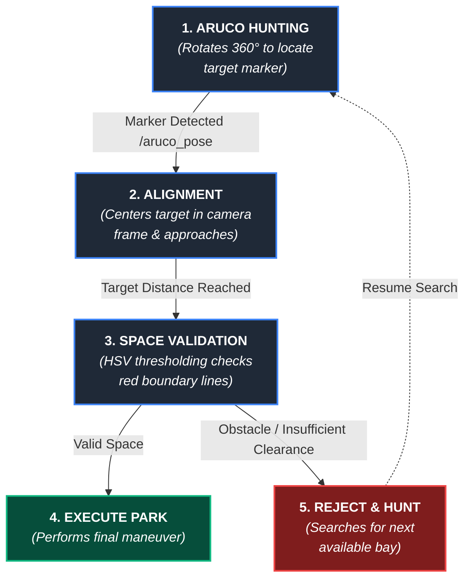

# AI-Based Autonomous Parking System for Mobile Robot

An autonomous mobile robot designed to navigate indoor environments, detect designated parking bays using computer vision, evaluate parking constraints in real time, and execute precise self-parking routines without human intervention. 

---

## 📋 Table of Contents

- [ Project Overview](#-project-overview)
- [System Architecture](#️-system-architecture)
  - [Hardware Components](#-hardware-components)
  - [Software & Networking](#-software--networking)
- [System Architecture & Data Flow](#-system-architecture--data-flow)
- [ Repository Structure](#-repository-structure)
- [ Usage & Deployment](#-usage--deployment)
  - [ Environment Setup](#-environment-setup)
  - [ System Time Synchronization](#️-system-time-synchronization)
  - [ Hardware & Sensing Nodes](#️-hardware--sensing-nodes)
- [ Mapping Process](#-mapping-process)
- [ Autonomous Parking Sequence (ArUco & Camera)](#️-autonomous-parking-sequence-aruco--camera)
  - [ Autonomous Parking FSM Workflow](#-autonomous-parking-fsm-workflow)
  - [ Terminal Execution](#-terminal-execution)


---

## 📌 Project Overview

This project presents a dual-tier distributed computing architecture for an autonomous parking robot. High-level computer vision and state management are processed on a **Raspberry Pi 5** via ROS 2, while real-time low-level motor actuation and encoder tracking are offloaded to a **Raspberry Pi Pico 2**. Sensor fusion between an IMU gyroscope and optical wheel encoders eliminates rotational drift to achieve precise alignment and parking.

---

## 🛠️ System Architecture

### 🛠️ Hardware Components

| Subsystem | Component | Description / Role |
| :--- | :--- | :--- |
| **High-Level Processing** | Raspberry Pi 5 | Runs ROS 2 (Jazzy/Humble), computer vision pipelines, and FSM logic |
| **Microcontroller** | Raspberry Pi Pico 2 | Low-level real-time motor control and optical encoder tracking |
| **Sensors** | 10 DOF Waveshare IMU (MPU6050) | Gyroscope turning angle measurement to eliminate rotational drift |
| | Onboard USB Camera | Visual input for ArUco tag detection and HSV line color masking |
| | Optical Wheel Encoders | Quadrature tick integration for linear distance measurement |
| **Actuation** | 4× DC Motors | Primary drive system for omnidirectional/differential movement |
| | 4× IBT-2 Motor Drivers | H-Bridge drivers for high-current PWM motor control |
| **Power System** | 16.8V Li-Ion Battery Pack | 4S Sony 18650 cell configuration managed by an onboard BMS |
| | 5V / 5A DC-DC Buck Converters | Voltage regulation for single-board computers and sensor logic |

### 💻 Software & Networking

| Layer | Technology | Purpose / Description |
| :--- | :--- | :--- |
| **Operating System** | Linux (Ubuntu) | Core operating system running on the Raspberry Pi 5 |
| **Robotics Framework** | ROS 2 (Jazzy / Humble) | Distributed middleware ecosystem managing modular nodes and topics |
| **Computer Vision** | OpenCV (Python) | Real-time image processing for ArUco tag detection and HSV line masking |
| **Networking & VPN** | Tailscale VPN | Encrypted peer-to-peer mesh network for wireless headless operation |
| **DDS Middleware** | Cyclone DDS | High-bandwidth, low-latency ROS 2 communications layer over Tailscale |
| **Remote Access** | SSH | Headless terminal access for wireless code execution and monitoring |

---
## 🔄 System Architecture & Data Flow

The system operates using a distributed ROS 2 node pipeline. Sensor streams from the hardware hardware nodes pass through perception and localization layers before reaching the Nav2 stack and base motor controller.



---

## 📂 Repository Structure

```text
pico_reader/
├── config/
│   ├── nav2_params.yaml         # Nav2 costmaps & planner parameters
│   └── slam_toolbox.yaml        # SLAM Toolbox parameters (Mapping & Localization)
├── launch/                      # Launch files directory
├── pico_reader/                 # Main Python package module
│   ├── __init__.py              # Python module initialization
│   ├── cmd_node.py              # Command / velocity processing node
│   ├── nav2_launch.py           # Nav2 stack launch script
│   ├── pico_node.py             # Pico microcontroller interface & odometry node
│   └── robot_launch.py          # Primary robot bringup launch script
├── resource/
│   └── pico_reader              # ROS 2 package index marker
├── package.xml                  # ROS 2 package manifest
├── setup.cfg                    # Package installation config
└── setup.py                     # Python package installer setup
```

---
## 🚀 Usage & Deployment

To run the complete system on the robot (including hardware nodes, LiDAR, TF, SLAM, and Nav2), follow the commands below.

### 🌐 Environment Setup
Before running any ROS 2 node across network interfaces via Tailscale DDS, ensure the Cyclone DDS middleware environment variables are declared:

```text
export RMW_IMPLEMENTATION=rmw_cyclonedds_cpp
export ROS_STATIC_PEERS=100.81.31.60
```
### ⏱️  System Time Synchronization
```bash
sudo /usr/local/bin/sync-time.sh
```
### 🕹️  Hardware & Sensing Nodes
Open separate terminals for each subsystem:

Terminal 1 — Base Driver (pico_node)
```bash
export RMW_IMPLEMENTATION=rmw_cyclonedds_cpp && export ROS_STATIC_PEERS=100.81.31.60
cd ~/robot_ws && source install/setup.bash
ros2 run pico_reader pico_node
```
Terminal 2 — Static Transform (tf2_ros)

```bash
export RMW_IMPLEMENTATION=rmw_cyclonedds_cpp && export ROS_STATIC_PEERS=100.81.31.60
ros2 run tf2_ros static_transform_publisher 0.18 0 0.58 0 0 0 base_link laser
```

Terminal 3 — LiDAR Sensor Driver (rplidar_ros)
```bash
export RMW_IMPLEMENTATION=rmw_cyclonedds_cpp && export ROS_STATIC_PEERS=100.81.31.60
ros2 launch rplidar_ros rplidar.launch.py
```
Terminal 4 — Mapping vs. Localization (Choose One)

Option A: Build a New Map (SLAM Mapping)

```bash
sed -i 's/mode: localization/mode: mapping/' ~/robot_ws/src/pico_reader/config/slam_toolbox.yaml
export RMW_IMPLEMENTATION=rmw_cyclonedds_cpp && export ROS_STATIC_PEERS=100.81.31.60
ros2 launch slam_toolbox online_async_launch.py slam_params_file:=/robot_ws/src/pico_reader/config/slam_toolbox.yaml
```
Option B: Localize on an Existing Map
```bash
export RMW_IMPLEMENTATION=rmw_cyclonedds_cpp && export ROS_STATIC_PEERS=100.81.31.60
ros2 launch slam_toolbox localization_launch.py slam_params_file:=/robot_ws/src/pico_reader/config/slam_toolbox.yaml
```
Terminal 5 — Navigation Stack (nav2)

```bash
export RMW_IMPLEMENTATION=rmw_cyclonedds_cpp && export ROS_STATIC_PEERS=100.81.31.60
cd ~/robot_ws && source install/setup.bash
ros2 launch pico_reader nav2_launch.py
```
Terminal 6 — Teleoperation Control
```bash
export RMW_IMPLEMENTATION=rmw_cyclonedds_cpp && export ROS_STATIC_PEERS=100.81.31.60
ros2 run teleop_twist_keyboard teleop_twist_keyboard --ros-args -p angular_speed:=2.0
```
## 🎥 Mapping Process

Here is a real-time demonstration of the SLAM mapping process using `slam_toolbox`:

<p align="center">
  
</p>

---
## 🅿️ Autonomous Parking Sequence (ArUco & Camera)
Once a map is generated or loaded, the vehicle initiates autonomous parking using visual feedback from the onboard USB camera. The system uses ArUco marker detection and HSV color thresholding to locate target bays, assess boundary constraints, and execute dynamic parking maneuvers.



---

### 🚀 Terminal Execution 
```bash
python3 ~/aruco_parking.py
```
<p align="center">
  
</p>
